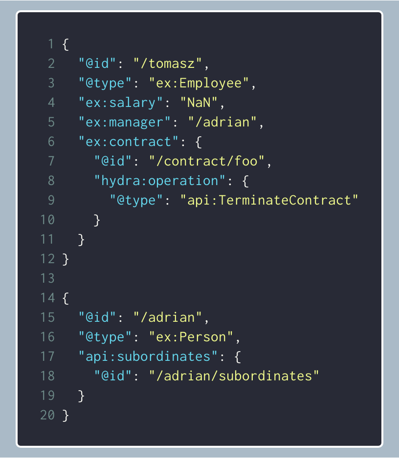
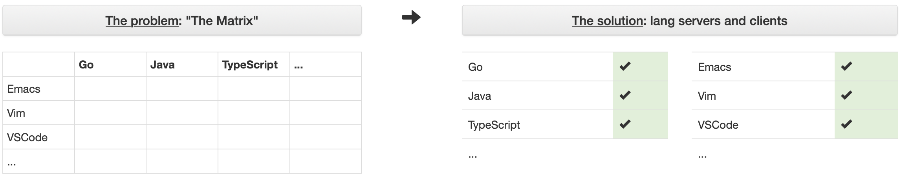
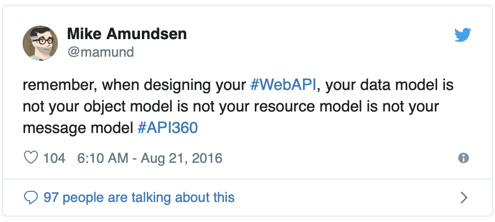

autoscale: true
footer: Tomasz Pluskiewicz ::  tpluscode :: API Days Barcelona :: 2019
# [fit] Testing APIs
## [fit] Hypermedia way

--- 

## About me

* Tomasz Pluskiewicz
* Zazuko GmbH
* Interests
  * Semantic Web
  * REST APIs
  * Hydra CG

 [ /tpluscode](https://github.com/tpluscode)
 [@tpluscode](https://twitter.com/tpluscode)


---

## Agenda

* `/Testing( Hypermedia)?( APIs)?/`
* Domain-Specific Language
* Lessons learned
* Roadmap

--- 

## REST Fest 

* 9th year in Greenville, SC
* Second time in Europe
* restfest.org and /@restfest


^
offer to post t-shirts

---

## Kinds of tests

---

### Kinds of tests

| | Unit | E2E |
| --- | --- | --- |
| **"Code"** | jUnit, Mocha | Selenium, Protractor |
| **APIs** | REST Assured, Postman, Karate | REST Assured, Karate |
| **Hypermedia** | N/A | ? |

^
Unit tests usually simply mean automatic tests
the tools too often focus on raw JSON

---

## Tester's first rule
### Tests should mimic consumer behavior

---

### Hypermedia aka REST architectural style

* Linked resources
* Self-descriptive messages (follow your nose)
* Resource representations

---

### How to test hypermedia?

1. Start from a single resource
1. Follow links
1. Perform only requests described in representations
1. Refrain from referencing concrete URLs
1. Do not rely on concrete message format

---

## Hypertest DSL
### [https://testing.hypermedia.app/](https://testing.hypermedia.app/)

---

## Hypertest DSL

```
With Class ex:Employee {
    Expect Property ex:salary
    Expect Link ex:manager

    Expect Property ex:contract {
        Expect Operation api:TerminateContract {
            Invoke {
                Expect Status 204
            }
        }
    }
}

With Link ex:manager {
    Expect Link api:subordinates 
}
```



---

## Hypertest DSL

* Core language
* Media-type-specific dialects
  * Currently only Hydra
* Built with Eclipse Xtext
* [Language Server Protocol](https://langserver.org)


^
unfortunately java **and** ecplise
consequence: compile and not interpret
LSP makes editor plugins possible

---

### Language Server Protocol



[Web editor](https://hypertest.zazukoians.org/)

---

## Lessons learned

---

## Lessons learned
### Test-first to drive design

--- 

## Test-first to drive design

- Design complex interactions so that they are discoverable by the test runner
- That way they will be discoverable by the client

---

### How the API can guide a client through its resources?
### 🤓 Demo time[^1] 🤓

[^1]: [https://gist.github.com/tpluscode/78b8214ab6df6bd9be5be8859a50e0e2](https://gist.github.com/tpluscode/78b8214ab6df6bd9be5be8859a50e0e2)

^
during demo create a project manually and see how it changes the test run

---

## Lessons learned

* API graph !== data graph [^2]



[^2]: https://twitter.com/mamund/status/767212233759657984

^
specific to JSON-LD but universal in principle

---

## So is it any good?

- Limited "programming" model
- Not interpreted, unless using Java
- Potential false positives
- Not a replacement for other approaches

---

## What's next for hypertest?

- Language features
- "Code" coverage
- Graphical report
- Editor plugins
- Dialects for more media types
  - Better runner

^
Features: reusability, coverage

---

## Learn more

[https://testing.hypermedia.app/dsl/](https://testing.hypermedia.app/dsl/)
[https://github.com/hypermedia-app/hypertest](https://github.com/hypermedia-app/hypertest)

Web editor: [https://hypertest.zazukoians.org/](https://hypertest.zazukoians.org/)

 /HypermediaApp

---

# Thank you