autoscale: true
Theme: Merriweather, 4
slide-dividers: #
slidenumbers: true
slidecount: true
footer: Tomasz Pluskiewicz ::  tpluscode :: [dynamit.pro](https://dynamit.pro) :: 2021

## Everything is connected
### Combating entropy in software

---

## Entropy in Physics

---

### All systems move in the direction of increasing entropy. 

> According to Boltzmann, systems move in the direction of increasing entropy because such states have a greater number of configurations, and the equilibrium state of highest entropy is the state with the greatest number of molecular configurations. [^Attard]

[^Attard]: [Phil Attard, in Thermodynamics and Statistical Mechanics, 2002](https://www.sciencedirect.com/topics/mathematics/increasing-entropy)

^ Częsteczki dążą do idealnego rozkładu, jednolitej temperatury

---

### Quantum wave function

* Quantum coin toss has both states simultaneously, with 50% probablity

* Once observed, quantum function collapsed into one state

* Another quantum coin, entangled will automatically have the other state

^ funkcja falowa

---

[.hide-footer]

^ Przed play: Na poziomie kwantowym, jeżeli znamy powiązanie cząsteczek, entropia wynosi zero

---

## Software architecture

^ Budując software, poruszamy się w przestrzeni kwantowej, pomiędzy komponentami

---

### Tier architecture

Every tier in a software system has its own view of part of the larger data model.

* database model
* business layer
* application layer
* presentation layer

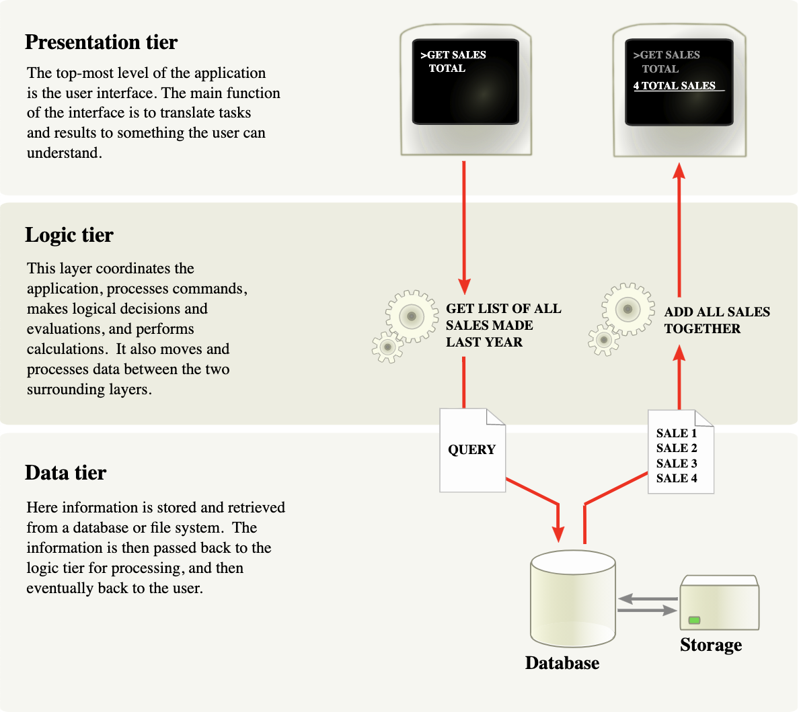

^ już tutaj nie można zaobserwować całej funkcji falowej, ponieważ nie zachodzi splątanie stanów
^ tak nas uczono, ale ma to konsekwencje w postaci entropii

---

### Hexagonal architecture

The hexagonal architecture divides a system into several loosely-coupled interchangeable components, [...].

 

Each component is connected to the others through a number of exposed "ports". Communication through these ports follow a given protocol depending on their purpose.

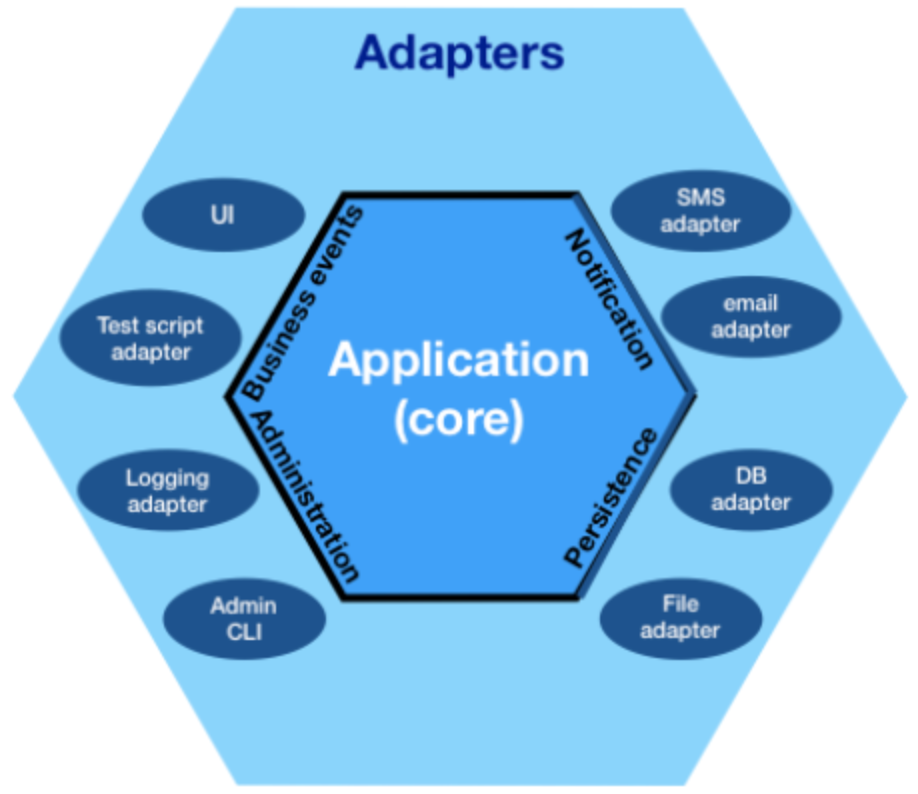

[^hex]: https://en.wikipedia.org/wiki/Hexagonal_architecture_(software)

---

### Paul Baran's Networks [^Barabasi]

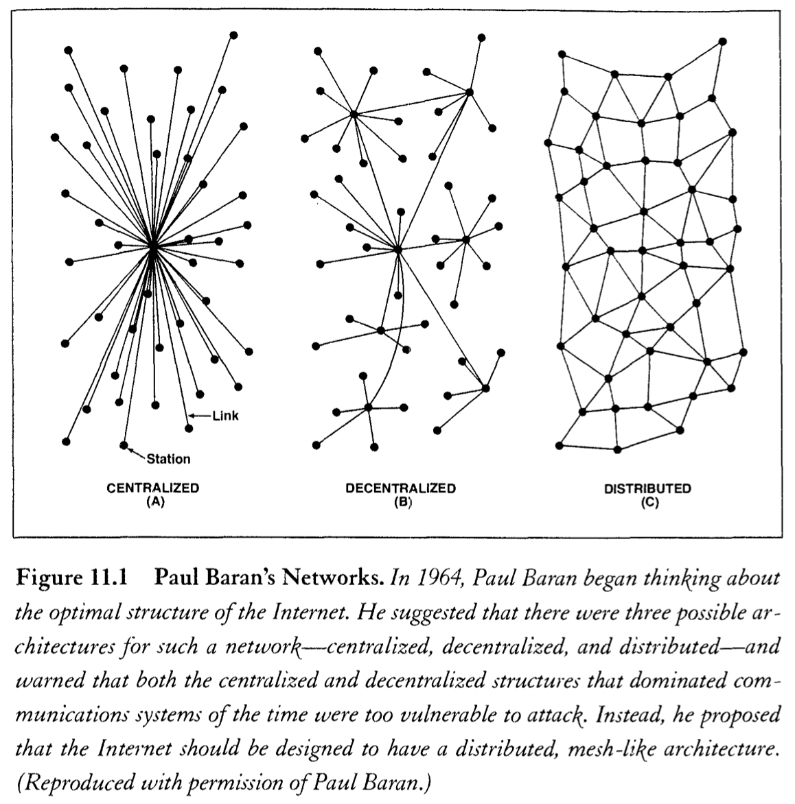

^Paul (Pesach) Baran. Pionier sieci
^Rozproszona sieć miała przetrwać III WŚ	

---

### Entropy in software

Every time data changes representation when moved between components, entropy increases.

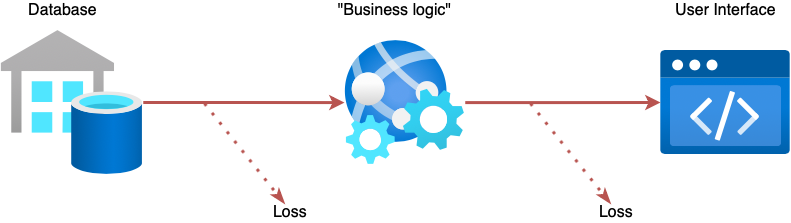

---

### When entropy increases

* Diverging models
* Technical differences
* Human-only (API) documentation
* Generated code
* Miscommunication

---

## Designing for lower entropy

---

## Everything is a resource
### if you're brave enough

---

### Or is it? [^mamund]

[^mamund]: [https://twitter.com/mamund/status/767212233759657984](https://twitter.com/mamund/status/767212233759657984)

---

### Linked Data

* Everything has an URI (resource)
* All resources are part of a "global API"
* Follow (open) web standards; make data useful to others
  * uniform resource representations (**RDF**, **[SHACL](https://w3.org/tr/shacl)**)
  * shared vocabularies (**[schema.org](http://schema.org)**, domain-specific, others)
  * interaction (**HTTP/REST**, [**Hydra**](https://www.hydra-cg.com/spec/latest/core/))

^
Follow your nose

---

### Example: Resource meta-model

---

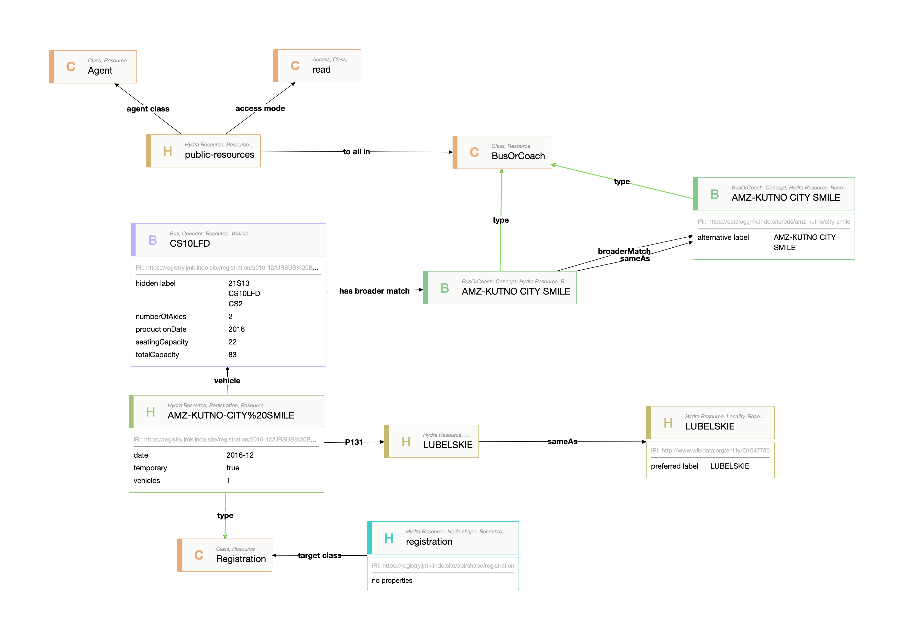

^
Next slide for link

---

### Demo

[Explore data](http://explore.jmk.lndo.site/#2ea7720ce0)

[Drive UI](https://forms.hypermedia.app/playground/#resource=%40prefix+rdf%3A+%3Chttp%3A%2F%2Fwww.w3.org%2F1999%2F02%2F22-rdf-syntax-ns%23%3E+.%0A%40prefix+rdfs%3A+%3Chttp%3A%2F%2Fwww.w3.org%2F2000%2F01%2Frdf-schema%23%3E+.%0A%40prefix+xsd%3A+%3Chttp%3A%2F%2Fwww.w3.org%2F2001%2FXMLSchema%23%3E+.%0A%40prefix+schema%3A+%3Chttp%3A%2F%2Fschema.org%2F%3E+.%0A%40prefix+foaf%3A+%3Chttp%3A%2F%2Fxmlns.com%2Ffoaf%2F0.1%2F%3E+.%0A%40prefix+vcard%3A+%3Chttp%3A%2F%2Fwww.w3.org%2F2006%2Fvcard%2Fns%23%3E+.%0A%0A%3C%3E+a+%3Chttps%3A%2F%2Fjmk.org.pl%2Fvocab%23Registration%3E+%3B%0A%09%3Chttps%3A%2F%2Fjmk.org.pl%2Fvocab%23vehicle%3E+%3CAMZ-KUTNO-CITY%2520SMILE%2Fvehicle%3E+%3B%0A%09%3Chttps%3A%2F%2Fjmk.org.pl%2Fvocab%23temporary%3E+true+%3B%0A%09%3Chttp%3A%2F%2Fpurl.org%2Fdc%2Fterms%2Fdate%3E+%222016-12%22%5E%5Exsd%3AgYearMonth+%3B%0A%09%3Chttp%3A%2F%2Fwww.w3.org%2F2006%2Ftime%23inDateTime%3E+%5B%0A%09%09%3Chttp%3A%2F%2Fwww.w3.org%2F2006%2Ftime%23year%3E+%222016%22%5E%5Exsd%3AgYear+%3B%0A%09%09%3Chttp%3A%2F%2Fwww.w3.org%2F2006%2Ftime%23month%3E+%22--12%22%5E%5Exsd%3AgMonth+%3B%0A%09%5D+%3B%0A%09%3Chttp%3A%2F%2Fwww.wikidata.org%2Fentity%2FP131%3E+%3C%2Flocality%2Fvoivodeship%2FLUBELSKIE%3E%2C+%3C%2Flocality%2Fcounty%2FLUBLIN%3E%2C+%3C%2Flocality%2Fmunicipality%2FM.%2520LUBLIN%3E%2C+%3C%2Flocality%2Fcity%2FLUBLIN%3E+%3B%0A%09%3Chttps%3A%2F%2Fjmk.org.pl%2Fvocab%23vehicles%3E+1+%3B%0A%09schema%3AisBasedOn+%3Cdataset%2Fexample-data%3E+%3B%0A%09%3Chttps%3A%2F%2Fjmk.org.pl%2Fvocab%23owner%3E+%3Chttps%3A%2F%2Fregistry.jmk.lndo.site%2Fcompany%2FURSUS%2520BUS%2520S.A.%3E+%3B%0A%09schema%3AitemCondition+schema%3ANewCondition+.%0A%0A%3CAMZ-KUTNO-CITY%2520SMILE%2Fvehicle%3E+a+%3Chttps%3A%2F%2Fjmk.org.pl%2Fvocab%23Bus%3E+%3B%0A%09%3Chttp%3A%2F%2Fwww.w3.org%2F2004%2F02%2Fskos%2Fcore%23hiddenLabel%3E+%22CS2%22%2C+%22CS10LFD%22%2C+%2221S13%22+%3B%0A%09%3Chttp%3A%2F%2Fwww.w3.org%2F2004%2F02%2Fskos%2Fcore%23broadMatch%3E+%3C%2Fvehicle%2FAMZ-KUTNO%2FCITY%2520SMILE%3E+%3B%0A%09%3Chttps%3A%2F%2Fjmk.org.pl%2Fvocab%23bodyBuilder%3E+%3C%2Fcompany%2FAMZ-KUTNO%3E+%3B%0A%09%3Chttps%3A%2F%2Fjmk.org.pl%2Fvocab%23bodyType%3E+%3C%2Fbody-type%2FMIEJSKI%3E+%3B%0A%09schema%3AproductionDate+%222016%22%5E%5Exsd%3AgYear+%3B%0A%09schema%3AweightTotal+%5B%0A%09%09schema%3Avalue+16000+%3B%0A%09%09schema%3AunitCode+%3Chttp%3A%2F%2Fqudt.org%2Fvocab%2Funit%2FKiloGM%3E+%3B%0A%09%5D+%3B%0A%09schema%3AdriveWheelConfiguration+%3C%2Fdrive-wheel-configuration%2F4X2%3E+%3B%0A%09schema%3AvehicleEngine+%5B%0A%09%09schema%3AengineDisplacement+%5B%0A%09%09%09schema%3Avalue+6700+%3B%0A%09%09%09schema%3AunitCode+%3Chttp%3A%2F%2Fqudt.org%2Fvocab%2Funit%2FCentiM3%3E+%3B%0A%09%09%5D+%3B%0A%09%09schema%3AenginePower+%5B%0A%09%09%09schema%3Avalue+204+%3B%0A%09%09%09schema%3AunitCode+%3Chttp%3A%2F%2Fqudt.org%2Fvocab%2Funit%2FHP%3E+%3B%0A%09%09%5D+%3B%0A%09%5D+%3B%0A%09schema%3AseatingCapacity+22+%3B%0A%09%3Chttps%3A%2F%2Fjmk.org.pl%2Fvocab%23totalCapacity%3E+83+%3B%0A%09schema%3AnumberOfAxles+2+%3B%0A%09schema%3AfuelType+%3Chttps%3A%2F%2Fregistry.jmk.lndo.site%2Ffuel-type%2FDIESEL%3E+.%0A%0A&shapes=%40prefix+rdf%3A+%3Chttp%3A%2F%2Fwww.w3.org%2F1999%2F02%2F22-rdf-syntax-ns%23%3E+.%0A%40prefix+rdfs%3A+%3Chttp%3A%2F%2Fwww.w3.org%2F2000%2F01%2Frdf-schema%23%3E+.%0A%40prefix+xsd%3A+%3Chttp%3A%2F%2Fwww.w3.org%2F2001%2FXMLSchema%23%3E+.%0A%40prefix+sh%3A+%3Chttp%3A%2F%2Fwww.w3.org%2Fns%2Fshacl%23%3E+.%0A%40prefix+dash%3A+%3Chttp%3A%2F%2Fdatashapes.org%2Fdash%23%3E+.%0A%0A_%3Ab29+a+rdfs%3AResource%2C+sh%3AShape%2C+sh%3APropertyShape+%3B%0A%09sh%3Adatatype+xsd%3Ainteger+%3B%0A%09sh%3AmaxCount+1+%3B%0A%09sh%3AminCount+1+%3B%0A%09sh%3Aname+%22Value%22+%3B%0A%09sh%3Apath+%3Chttp%3A%2F%2Fschema.org%2Fvalue%3E+.%0A%0A%3Chttps%3A%2F%2Fregistry.jmk.lndo.site%2Fapi%2Fshape%2Fregistration%3E+a+sh%3ANodeShape%2C+rdfs%3AResource%2C+sh%3AShape%2C+%3Chttp%3A%2F%2Fwww.w3.org%2Fns%2Fhydra%2Fcore%23Resource%3E+%3B%0A%09%3Chttp%3A%2F%2Fwww.w3.org%2Fns%2Fhydra%2Fcore%23apiDocumentation%3E+%3Chttps%3A%2F%2Fregistry.jmk.lndo.site%2Fapi%3E+%3B%0A%09sh%3Aproperty+%5B%0A%09%09rdf%3Atype+rdfs%3AResource%2C+sh%3AShape%2C+sh%3APropertyShape+%3B%0A%09%09dash%3Ahidden+true+%3B%0A%09%09sh%3AmaxCount+1+%3B%0A%09%09sh%3AminCount+1+%3B%0A%09%09sh%3Aname+%22Source+dataset%22+%3B%0A%09%09sh%3AnodeKind+sh%3AIRI+%3B%0A%09%09sh%3Apath+%3Chttp%3A%2F%2Fschema.org%2FisBasedOn%3E+%3B%0A%09%5D%2C+%5B%0A%09%09rdf%3Atype+rdfs%3AResource%2C+sh%3AShape%2C+sh%3APropertyShape+%3B%0A%09%09sh%3Adatatype+xsd%3Ainteger+%3B%0A%09%09sh%3AmaxCount+1+%3B%0A%09%09sh%3AminCount+1+%3B%0A%09%09sh%3AminInclusive+1+%3B%0A%09%09sh%3Aname+%22Number+registered%22+%3B%0A%09%09sh%3Aorder+20+%3B%0A%09%09sh%3Apath+%3Chttps%3A%2F%2Fjmk.org.pl%2Fvocab%23vehicles%3E+%3B%0A%09%5D%2C+%5B%0A%09%09rdf%3Atype+rdfs%3AResource%2C+sh%3AShape%2C+sh%3APropertyShape+%3B%0A%09%09sh%3Adatatype+xsd%3Aboolean+%3B%0A%09%09sh%3AmaxCount+1+%3B%0A%09%09sh%3AminCount+1+%3B%0A%09%09sh%3Aname+%22Temporary%22+%3B%0A%09%09sh%3Aorder+50+%3B%0A%09%09sh%3Apath+%3Chttps%3A%2F%2Fjmk.org.pl%2Fvocab%23temporary%3E+%3B%0A%09%5D%2C+%5B%0A%09%09rdf%3Atype+rdfs%3AResource%2C+sh%3AShape%2C+sh%3APropertyShape+%3B%0A%09%09%3Chttp%3A%2F%2Fwww.w3.org%2Fns%2Fhydra%2Fcore%23collection%3E+%3Chttps%3A%2F%2Fregistry.jmk.lndo.site%2F_dictionary%2Fconditions%3E+%3B%0A%09%09sh%3AmaxCount+1+%3B%0A%09%09sh%3AminCount+1+%3B%0A%09%09sh%3Aname+%22New+or+used%22+%3B%0A%09%09sh%3Aorder+30+%3B%0A%09%09sh%3Apath+%3Chttp%3A%2F%2Fschema.org%2FitemCondition%3E+%3B%0A%09%5D%2C+%5B%0A%09%09rdf%3Atype+rdfs%3AResource%2C+sh%3AShape%2C+sh%3APropertyShape+%3B%0A%09%09dash%3Aeditor+dash%3AInstancesSelectEditor+%3B%0A%09%09dash%3AreadOnly+true+%3B%0A%09%09sh%3AminCount+1+%3B%0A%09%09sh%3Aname+%22Location%22+%3B%0A%09%09sh%3Aorder+100+%3B%0A%09%09sh%3Apath+%3Chttp%3A%2F%2Fwww.wikidata.org%2Fentity%2FP131%3E+%3B%0A%09%5D%2C+%5B%0A%09%09rdf%3Atype+rdfs%3AResource%2C+sh%3AShape%2C+sh%3APropertyShape+%3B%0A%09%09%3Chttp%3A%2F%2Fwww.w3.org%2Fns%2Fhydra%2Fcore%23collection%3E+%3Chttps%3A%2F%2Fregistry.jmk.lndo.site%2Fcompanies%3E+%3B%0A%09%09sh%3AmaxCount+1+%3B%0A%09%09sh%3AminCount+1+%3B%0A%09%09sh%3Aname+%22Company%22+%3B%0A%09%09sh%3Aorder+40+%3B%0A%09%09sh%3Apath+%3Chttps%3A%2F%2Fjmk.org.pl%2Fvocab%23owner%3E+%3B%0A%09%5D%2C+%5B%0A%09%09rdf%3Atype+rdfs%3AResource%2C+sh%3AShape%2C+sh%3APropertyShape+%3B%0A%09%09dash%3Aeditor+dash%3ADetailsEditor+%3B%0A%09%09sh%3AmaxCount+1+%3B%0A%09%09sh%3AminCount+1+%3B%0A%09%09sh%3Aname+%22Vehicle+details%22+%3B%0A%09%09sh%3Anode+%5B%0A%09%09%09rdf%3Atype+sh%3ANodeShape%2C+rdfs%3AResource%2C+sh%3AShape+%3B%0A%09%09%09sh%3Aproperty+%5B%0A%09%09%09%09rdf%3Atype+rdfs%3AResource%2C+sh%3AShape%2C+sh%3APropertyShape+%3B%0A%09%09%09%09sh%3Adatatype+xsd%3Astring+%3B%0A%09%09%09%09sh%3Apath+%3Chttp%3A%2F%2Fwww.w3.org%2F2004%2F02%2Fskos%2Fcore%23hiddenLabel%3E+%3B%0A%09%09%09%5D%2C+%5B%0A%09%09%09%09rdf%3Atype+rdfs%3AResource%2C+sh%3AShape%2C+sh%3APropertyShape+%3B%0A%09%09%09%09dash%3Aeditor+dash%3AInstancesSelectEditor+%3B%0A%09%09%09%09dash%3AreadOnly+true+%3B%0A%09%09%09%09sh%3AmaxCount+1+%3B%0A%09%09%09%09sh%3Apath+%3Chttp%3A%2F%2Fwww.w3.org%2F2004%2F02%2Fskos%2Fcore%23broadMatch%3E+%3B%0A%09%09%09%5D%2C+%5B%0A%09%09%09%09rdf%3Atype+rdfs%3AResource%2C+sh%3AShape%2C+sh%3APropertyShape+%3B%0A%09%09%09%09sh%3Adatatype+xsd%3AgYear+%3B%0A%09%09%09%09sh%3AmaxCount+1+%3B%0A%09%09%09%09sh%3AminCount+1+%3B%0A%09%09%09%09sh%3Apath+%3Chttp%3A%2F%2Fschema.org%2FproductionDate%3E+%3B%0A%09%09%09%5D%2C+%5B%0A%09%09%09%09rdf%3Atype+rdfs%3AResource%2C+sh%3AShape%2C+sh%3APropertyShape+%3B%0A%09%09%09%09%3Chttp%3A%2F%2Fwww.w3.org%2Fns%2Fhydra%2Fcore%23collection%3E+%3Chttps%3A%2F%2Fregistry.jmk.lndo.site%2F_dictionary%2Fbody-types%3E+%3B%0A%09%09%09%09sh%3AmaxCount+1+%3B%0A%09%09%09%09sh%3AminCount+1+%3B%0A%09%09%09%09sh%3Aname+%22Body+type%22+%3B%0A%09%09%09%09sh%3Apath+%3Chttps%3A%2F%2Fjmk.org.pl%2Fvocab%23bodyType%3E+%3B%0A%09%09%09%5D%2C+%5B%0A%09%09%09%09rdf%3Atype+rdfs%3AResource%2C+sh%3AShape%2C+sh%3APropertyShape+%3B%0A%09%09%09%09dash%3Aeditor+dash%3ADetailsEditor+%3B%0A%09%09%09%09sh%3AmaxCount+1+%3B%0A%09%09%09%09sh%3AminCount+1+%3B%0A%09%09%09%09sh%3Aname+%22Engine%22+%3B%0A%09%09%09%09sh%3Anode+%5B%0A%09%09%09%09%09rdf%3Atype+sh%3ANodeShape%2C+rdfs%3AResource%2C+sh%3AShape+%3B%0A%09%09%09%09%09sh%3Aproperty+%5B%0A%09%09%09%09%09%09rdf%3Atype+rdfs%3AResource%2C+sh%3AShape%2C+sh%3APropertyShape+%3B%0A%09%09%09%09%09%09dash%3Aeditor+dash%3ADetailsEditor+%3B%0A%09%09%09%09%09%09sh%3AmaxCount+1+%3B%0A%09%09%09%09%09%09sh%3AminCount+1+%3B%0A%09%09%09%09%09%09sh%3Aname+%22Displacement%22+%3B%0A%09%09%09%09%09%09sh%3Anode+%5B%0A%09%09%09%09%09%09%09rdf%3Atype+sh%3ANodeShape%2C+rdfs%3AResource%2C+sh%3AShape+%3B%0A%09%09%09%09%09%09%09sh%3Aproperty+_%3Ab29%2C+%5B%0A%09%09%09%09%09%09%09%09rdf%3Atype+rdfs%3AResource%2C+sh%3AShape%2C+sh%3APropertyShape+%3B%0A%09%09%09%09%09%09%09%09%3Chttp%3A%2F%2Fwww.w3.org%2Fns%2Fhydra%2Fcore%23collection%3E+%3Chttps%3A%2F%2Fregistry.jmk.lndo.site%2F_dictionary%2Funits%2Fvolume%3E+%3B%0A%09%09%09%09%09%09%09%09sh%3AmaxCount+1+%3B%0A%09%09%09%09%09%09%09%09sh%3AminCount+1+%3B%0A%09%09%09%09%09%09%09%09sh%3Aname+%22Unit%22+%3B%0A%09%09%09%09%09%09%09%09sh%3Apath+%3Chttp%3A%2F%2Fschema.org%2FunitCode%3E+%3B%0A%09%09%09%09%09%09%09%5D+%3B%0A%09%09%09%09%09%09%5D+%3B%0A%09%09%09%09%09%09sh%3Apath+%3Chttp%3A%2F%2Fschema.org%2FengineDisplacement%3E+%3B%0A%09%09%09%09%09%5D%2C+%5B%0A%09%09%09%09%09%09rdf%3Atype+rdfs%3AResource%2C+sh%3AShape%2C+sh%3APropertyShape+%3B%0A%09%09%09%09%09%09dash%3Aeditor+dash%3ADetailsEditor+%3B%0A%09%09%09%09%09%09sh%3AmaxCount+1+%3B%0A%09%09%09%09%09%09sh%3AminCount+1+%3B%0A%09%09%09%09%09%09sh%3Aname+%22Power%22+%3B%0A%09%09%09%09%09%09sh%3Anode+%5B%0A%09%09%09%09%09%09%09rdf%3Atype+sh%3ANodeShape%2C+rdfs%3AResource%2C+sh%3AShape+%3B%0A%09%09%09%09%09%09%09sh%3Aproperty+_%3Ab29%2C+%5B%0A%09%09%09%09%09%09%09%09rdf%3Atype+rdfs%3AResource%2C+sh%3AShape%2C+sh%3APropertyShape+%3B%0A%09%09%09%09%09%09%09%09%3Chttp%3A%2F%2Fwww.w3.org%2Fns%2Fhydra%2Fcore%23collection%3E+%3Chttps%3A%2F%2Fregistry.jmk.lndo.site%2F_dictionary%2Funits%2Fengine-power%3E+%3B%0A%09%09%09%09%09%09%09%09sh%3AmaxCount+1+%3B%0A%09%09%09%09%09%09%09%09sh%3AminCount+1+%3B%0A%09%09%09%09%09%09%09%09sh%3Aname+%22Unit%22+%3B%0A%09%09%09%09%09%09%09%09sh%3Apath+%3Chttp%3A%2F%2Fschema.org%2FunitCode%3E+%3B%0A%09%09%09%09%09%09%09%5D+%3B%0A%09%09%09%09%09%09%5D+%3B%0A%09%09%09%09%09%09sh%3Apath+%3Chttp%3A%2F%2Fschema.org%2FenginePower%3E+%3B%0A%09%09%09%09%09%5D+%3B%0A%09%09%09%09%5D+%3B%0A%09%09%09%09sh%3Apath+%3Chttp%3A%2F%2Fschema.org%2FvehicleEngine%3E+%3B%0A%09%09%09%5D%2C+%5B%0A%09%09%09%09rdf%3Atype+rdfs%3AResource%2C+sh%3AShape%2C+sh%3APropertyShape+%3B%0A%09%09%09%09dash%3Aeditor+dash%3ADetailsEditor+%3B%0A%09%09%09%09sh%3AmaxCount+1+%3B%0A%09%09%09%09sh%3AminCount+1+%3B%0A%09%09%09%09sh%3Aname+%22GWT%22+%3B%0A%09%09%09%09sh%3Anode+%5B%0A%09%09%09%09%09rdf%3Atype+sh%3ANodeShape%2C+rdfs%3AResource%2C+sh%3AShape+%3B%0A%09%09%09%09%09sh%3Aproperty+_%3Ab29%2C+%5B%0A%09%09%09%09%09%09rdf%3Atype+rdfs%3AResource%2C+sh%3AShape%2C+sh%3APropertyShape+%3B%0A%09%09%09%09%09%09%3Chttp%3A%2F%2Fwww.w3.org%2Fns%2Fhydra%2Fcore%23collection%3E+%3Chttps%3A%2F%2Fregistry.jmk.lndo.site%2F_dictionary%2Funits%2Fmass%3E+%3B%0A%09%09%09%09%09%09sh%3AmaxCount+1+%3B%0A%09%09%09%09%09%09sh%3AminCount+1+%3B%0A%09%09%09%09%09%09sh%3Aname+%22Unit%22+%3B%0A%09%09%09%09%09%09sh%3Apath+%3Chttp%3A%2F%2Fschema.org%2FunitCode%3E+%3B%0A%09%09%09%09%09%5D+%3B%0A%09%09%09%09%5D+%3B%0A%09%09%09%09sh%3Apath+%3Chttp%3A%2F%2Fschema.org%2FweightTotal%3E+%3B%0A%09%09%09%5D%2C+%5B%0A%09%09%09%09rdf%3Atype+rdfs%3AResource%2C+sh%3AShape%2C+sh%3APropertyShape+%3B%0A%09%09%09%09sh%3Ain+%5B%0A%09%09%09%09%09rdf%3Atype+rdfs%3AResource%2C+rdf%3AList+%3B%0A%09%09%09%09%09rdf%3Afirst+2+%3B%0A%09%09%09%09%09rdf%3Arest+%5B%0A%09%09%09%09%09%09rdf%3Atype+rdfs%3AResource%2C+rdf%3AList+%3B%0A%09%09%09%09%09%09rdf%3Afirst+3+%3B%0A%09%09%09%09%09%09rdf%3Arest+%5B%0A%09%09%09%09%09%09%09rdf%3Atype+rdfs%3AResource%2C+rdf%3AList+%3B%0A%09%09%09%09%09%09%09rdf%3Afirst+4+%3B%0A%09%09%09%09%09%09%09rdf%3Arest+rdf%3Anil+%3B%0A%09%09%09%09%09%09%5D+%3B%0A%09%09%09%09%09%5D+%3B%0A%09%09%09%09%5D+%3B%0A%09%09%09%09sh%3AmaxCount+1+%3B%0A%09%09%09%09sh%3AminCount+1+%3B%0A%09%09%09%09sh%3Aname+%22Number+of+axles%22+%3B%0A%09%09%09%09sh%3Apath+%3Chttp%3A%2F%2Fschema.org%2FnumberOfAxles%3E+%3B%0A%09%09%09%5D%2C+%5B%0A%09%09%09%09rdf%3Atype+rdfs%3AResource%2C+sh%3AShape%2C+sh%3APropertyShape+%3B%0A%09%09%09%09%3Chttp%3A%2F%2Fwww.w3.org%2Fns%2Fhydra%2Fcore%23collection%3E+%3Chttps%3A%2F%2Fregistry.jmk.lndo.site%2F_dictionary%2Fdrive-wheel-configurations%3E+%3B%0A%09%09%09%09sh%3AmaxCount+1+%3B%0A%09%09%09%09sh%3AminCount+1+%3B%0A%09%09%09%09sh%3Aname+%22Drive+wheel+configuration%22+%3B%0A%09%09%09%09sh%3Apath+%3Chttp%3A%2F%2Fschema.org%2FdriveWheelConfiguration%3E+%3B%0A%09%09%09%5D%2C+%5B%0A%09%09%09%09rdf%3Atype+rdfs%3AResource%2C+sh%3AShape%2C+sh%3APropertyShape+%3B%0A%09%09%09%09%3Chttp%3A%2F%2Fwww.w3.org%2Fns%2Fhydra%2Fcore%23collection%3E+%3Chttps%3A%2F%2Fregistry.jmk.lndo.site%2F_dictionary%2Ffuel-types%3E+%3B%0A%09%09%09%09sh%3AmaxCount+1+%3B%0A%09%09%09%09sh%3AminCount+1+%3B%0A%09%09%09%09sh%3Aname+%22Fuel+type%22+%3B%0A%09%09%09%09sh%3Apath+%3Chttp%3A%2F%2Fschema.org%2FfuelType%3E+%3B%0A%09%09%09%5D%2C+%5B%0A%09%09%09%09rdf%3Atype+rdfs%3AResource%2C+sh%3AShape%2C+sh%3APropertyShape+%3B%0A%09%09%09%09sh%3Adatatype+xsd%3Ainteger+%3B%0A%09%09%09%09sh%3AlessThanOrEquals+%3Chttps%3A%2F%2Fjmk.org.pl%2Fvocab%23totalCapacity%3E+%3B%0A%09%09%09%09sh%3AmaxCount+1+%3B%0A%09%09%09%09sh%3AminCount+1+%3B%0A%09%09%09%09sh%3Aname+%22Seating+capacity%22+%3B%0A%09%09%09%09sh%3Apath+%3Chttp%3A%2F%2Fschema.org%2FseatingCapacity%3E+%3B%0A%09%09%09%5D%2C+%5B%0A%09%09%09%09rdf%3Atype+rdfs%3AResource%2C+sh%3AShape%2C+sh%3APropertyShape+%3B%0A%09%09%09%09sh%3Adatatype+xsd%3Ainteger+%3B%0A%09%09%09%09sh%3AmaxCount+1+%3B%0A%09%09%09%09sh%3AminCount+1+%3B%0A%09%09%09%09sh%3Aname+%22Total+capacity%22+%3B%0A%09%09%09%09sh%3Apath+%3Chttps%3A%2F%2Fjmk.org.pl%2Fvocab%23totalCapacity%3E+%3B%0A%09%09%09%5D+%3B%0A%09%09%5D+%3B%0A%09%09sh%3Aorder+60+%3B%0A%09%09sh%3Apath+%3Chttps%3A%2F%2Fjmk.org.pl%2Fvocab%23vehicle%3E+%3B%0A%09%5D%2C+%5B%0A%09%09rdf%3Atype+rdfs%3AResource%2C+sh%3AShape%2C+sh%3APropertyShape+%3B%0A%09%09dash%3AreadOnly+true+%3B%0A%09%09sh%3Adatatype+xsd%3AgYearMonth+%3B%0A%09%09sh%3AmaxCount+1+%3B%0A%09%09sh%3AminCount+1+%3B%0A%09%09sh%3Aname+%22Date+registered%22+%3B%0A%09%09sh%3Aorder+10+%3B%0A%09%09sh%3Apath+%3Chttp%3A%2F%2Fpurl.org%2Fdc%2Fterms%2Fdate%3E+%3B%0A%09%5D%2C+%5B%0A%09%09rdf%3Atype+rdfs%3AResource%2C+sh%3AShape%2C+sh%3APropertyShape+%3B%0A%09%09dash%3Ahidden+true+%3B%0A%09%09sh%3AmaxCount+1+%3B%0A%09%09sh%3AminCount+1+%3B%0A%09%09sh%3Anode+%5B%0A%09%09%09rdf%3Atype+sh%3ANodeShape%2C+rdfs%3AResource%2C+sh%3AShape+%3B%0A%09%09%09sh%3Aproperty+%5B%0A%09%09%09%09rdf%3Atype+rdfs%3AResource%2C+sh%3AShape%2C+sh%3APropertyShape+%3B%0A%09%09%09%09sh%3AmaxCount+1+%3B%0A%09%09%09%09sh%3AminCount+1+%3B%0A%09%09%09%09sh%3Apath+%3Chttp%3A%2F%2Fwww.w3.org%2F2006%2Ftime%23month%3E+%3B%0A%09%09%09%09sh%3Apattern+%22--%5C%5Cd%5C%5Cd%22+%3B%0A%09%09%09%5D%2C+%5B%0A%09%09%09%09rdf%3Atype+rdfs%3AResource%2C+sh%3AShape%2C+sh%3APropertyShape+%3B%0A%09%09%09%09sh%3Adatatype+xsd%3AgYear+%3B%0A%09%09%09%09sh%3AmaxCount+1+%3B%0A%09%09%09%09sh%3AminCount+1+%3B%0A%09%09%09%09sh%3Apath+%3Chttp%3A%2F%2Fwww.w3.org%2F2006%2Ftime%23year%3E+%3B%0A%09%09%09%09sh%3Apattern+%22%5B12%5D%5C%5Cd%5C%5Cd%5C%5Cd%22+%3B%0A%09%09%09%5D+%3B%0A%09%09%5D+%3B%0A%09%09sh%3Apath+%3Chttp%3A%2F%2Fwww.w3.org%2F2006%2Ftime%23inDateTime%3E+%3B%0A%09%5D+%3B%0A%09sh%3AtargetClass+%3Chttps%3A%2F%2Fjmk.org.pl%2Fvocab%23Registration%3E+.%0A%0A)

---

### Example: Crossing boundaries

---

### Geographic Entities

Identifiers local to each component, troublesome to correlate

| Voivodeship  | Component 1 | Component 2 | Component 3 |
| ---          | ---         | ---         | ---         | 
| Dolnośląskie | 1           | 7           | D           |
| Mazowieckie  | 2           | 9           | M           |
| Śląskie      | 3           | 3           | S           |
| Opolskie     | 4           | 10          | O           |
| ... ||||

---

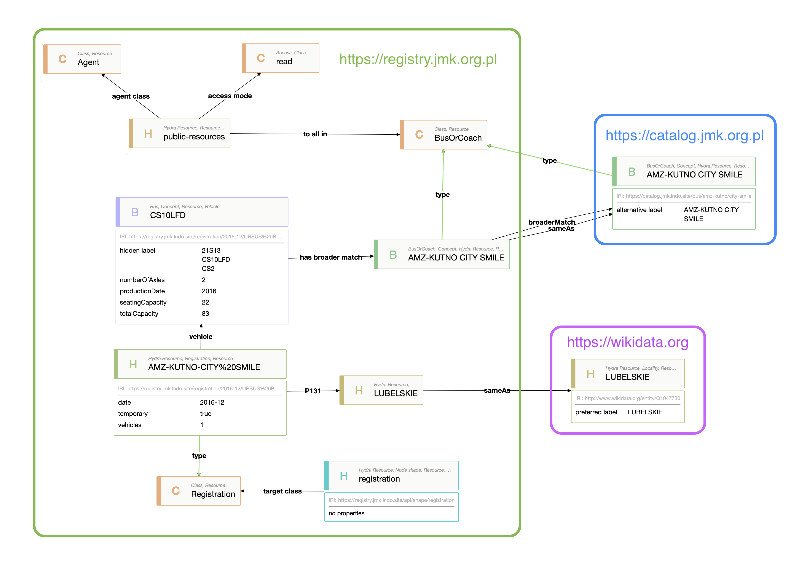

---

### Query across boundaries

Not only merge data from multiple sources, but also connect at runtime

Directly to the source system

This is called a federated query

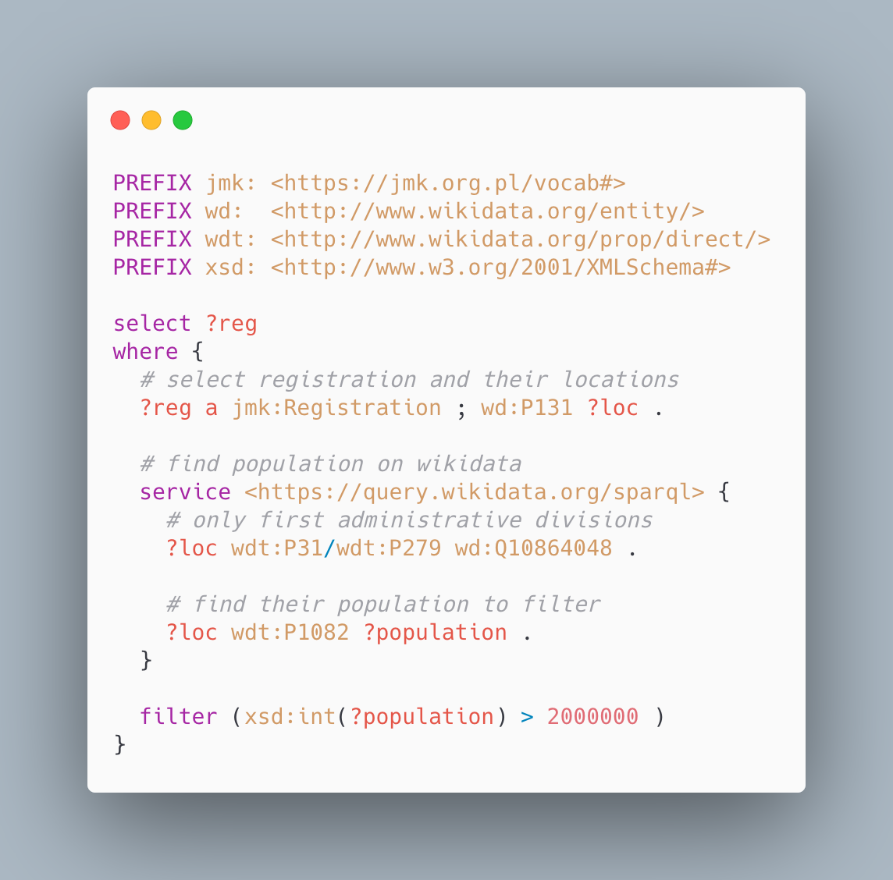

^
System can easily be split in an agile way

---

### Example: Access Control

---

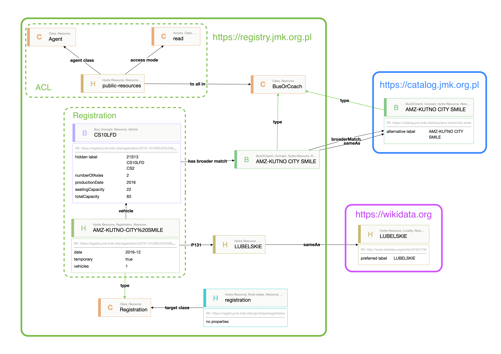

---

### Authorization

* Is also a resource
* Linked and queried directly
* Can be part of API
* Same database or distributed
* [Another standard](https://github.com/solid/web-access-control-spec), by Tim Berners‑Lee 

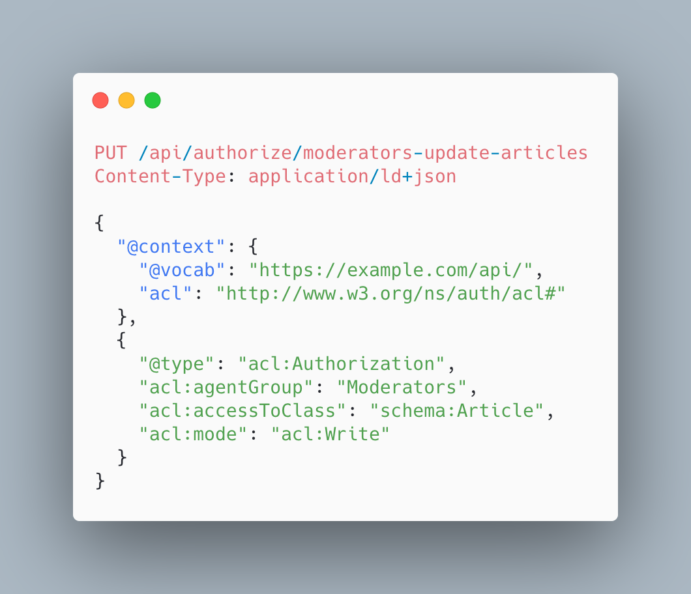

---

### Summary

* Model everything as a graph
* Uniform representation
* Lossless data integration
* Distributed by nature

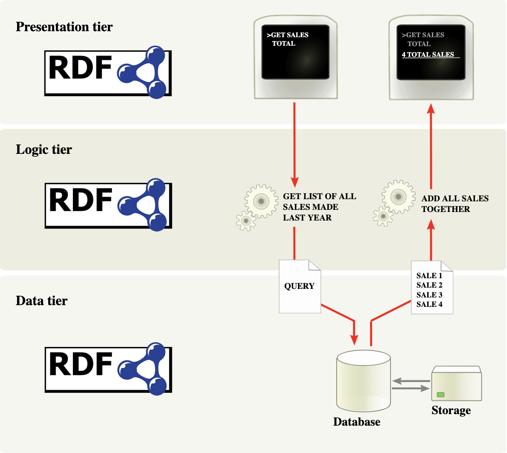

---

### Bonus - mix & match

[.column]

#### Domain-Driven Design
* Embed ubiquitous language in universal model
* Model (sub)graphs as aggregates and entities

#### Event driven 
* Model events as resources 
  * [W3C Activity Streams](https://www.w3.org/TR/activitystreams-core/)
* Link to other resources

[.column]

#### CQRS
* Execute commands locally
  * individual graph
* Query globally
  * across all graphs

---

### Gotchas

[.column]

**Learning curve**

* Graph feels alien
* Basic building blocks for complex solutions
* Hard to find talent
* Limited learning resources

[.column]

**RDF != Neo4j etc.**

* Open vs Closed
* Queries and analytics

**Not a silver bullet**

* But comes damn close IMO :smile:

---

## The Data-Centric Manifesto

---

### Data is the center of the universe; applications are ephemeral.

These are the key principles of the data centric manifesto:

1. Data is a key asset of any organization.
1. Data is self-describing and does not rely on an application for interpretation and meaning.
1. Data is expressed in open, non-proprietary formats.
1. Access to and security of the data is a responsibility of the data layer, and not managed by applications.
1. Applications are allowed to visit the data, perform their magic and express the results of their process back into the data layer for all to share.

[http://www.datacentricmanifesto.org](http://www.datacentricmanifesto.org)

---

### Other ways to think about the data centric revolution [^principles]

[.column]

#### NOW: Application-Centric

* Exorbitant, often prohibitive, cost of change.
* Data is tied up in applications because applications own data.
* Every new project comes with a big data conversion project.
* Data exists in wide variety of heterogeneous formats, structures, meaning, and terminology.
* Data integration consumes 35%-65% of IT budget.
* Hard or impossible to integrate external data with internal data.

[.column]

#### FUTURE: Data-Centric 
* Reasonable cost of change.
* Data is an open resource that outlives any given application.
* Every new project taps into existing data stores.
* Data is globally integrated sharing a common meaning, being exported from a common source into any needed format.
* Data integration will be nearly free.
* Internal and external data readily integrated.

[^principles]: [http://www.datacentricmanifesto.org/principles/](http://www.datacentricmanifesto.org/principles/)

---

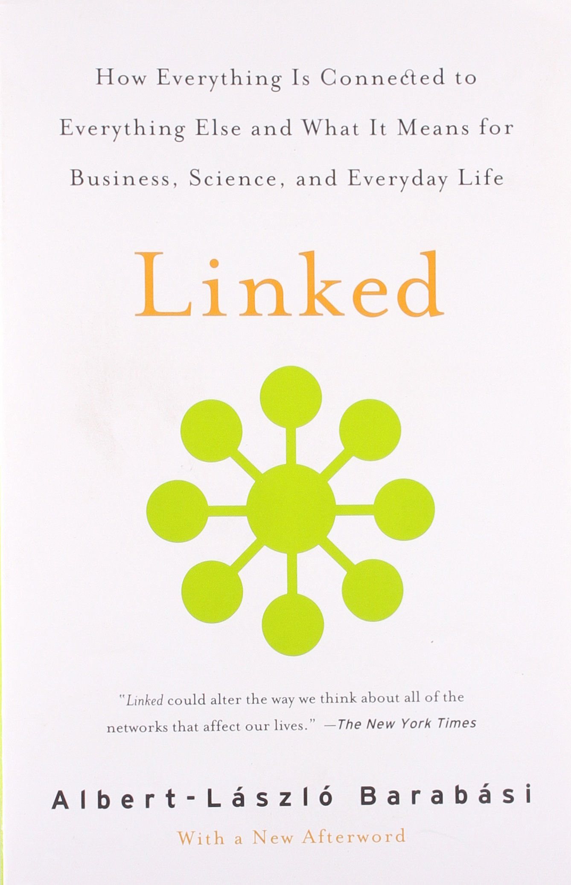

> Where do we go from here? The answer is simple. We must remove the wrapping. The goal before us is to understand complexity. To achieve that we must move beyond structure and topology and start focusing on the dynamics that take place along the links. [^Barabasi]

[^Barabasi]: [Linked: How Everything Is Connected to Everything Else and What It Means for Business, Science, and Everyday Life](https://www.amazon.com/Linked-Everything-Connected-Business-Everyday/dp/0452284392)

---

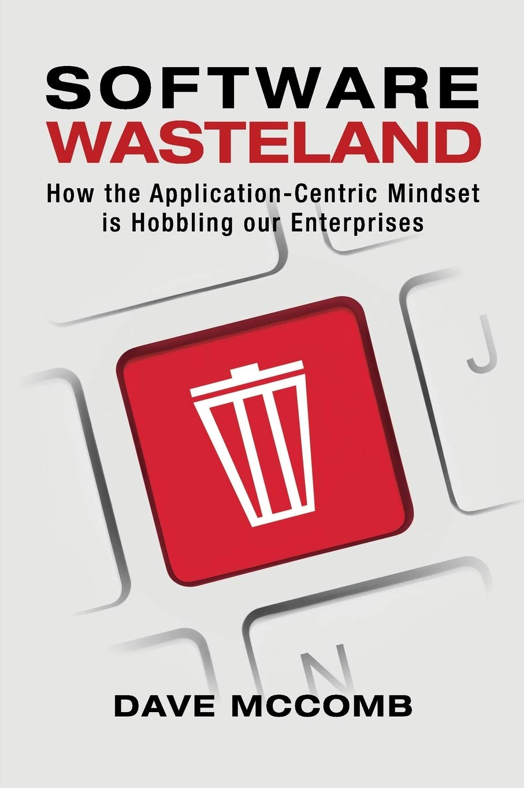
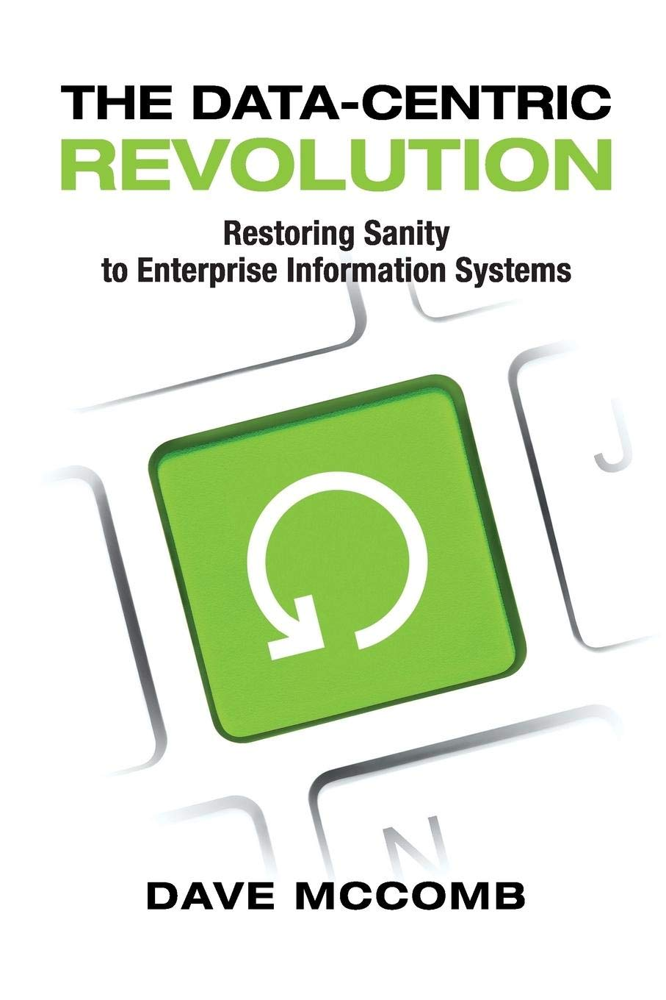

---
[.hide-footer]

## Thank you for listening

### Tomasz Pluskiewicz

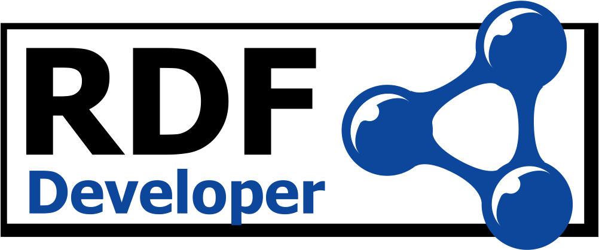 

[ tpluscode](https://twitter.com/tpluscode)
[ tpluscode](https://github.com/tpluscode)
🗒 [https://t-code.pl](https://t-code.pl)

