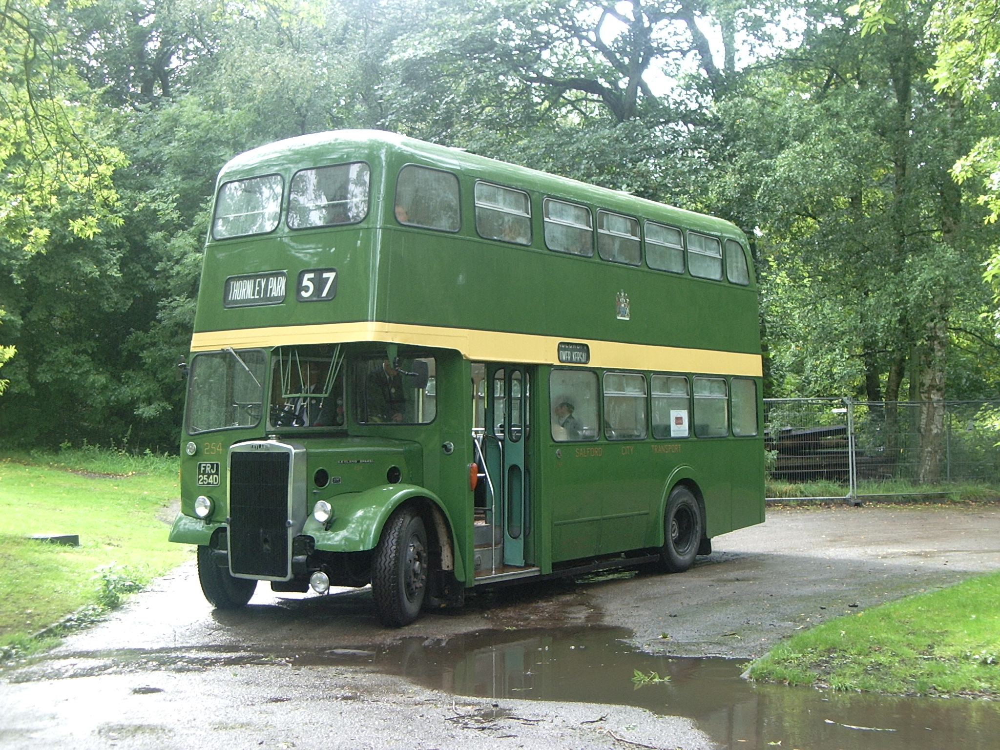
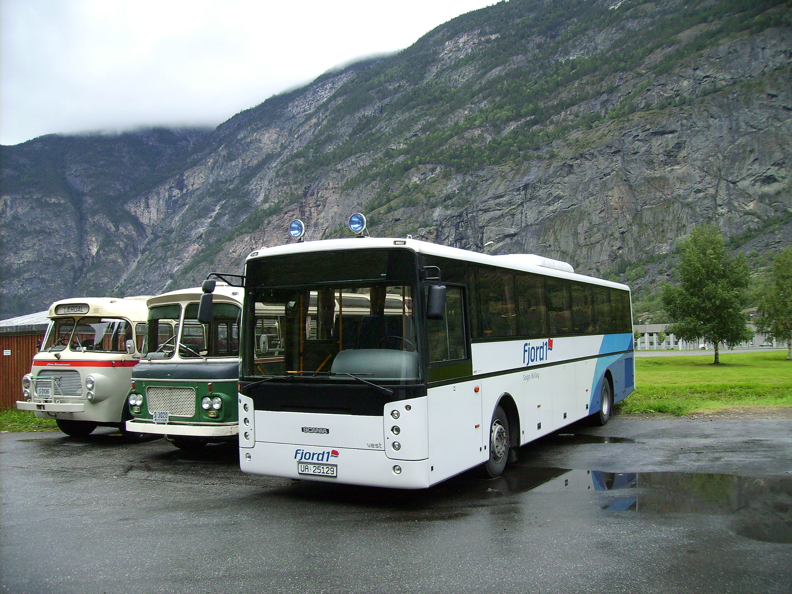
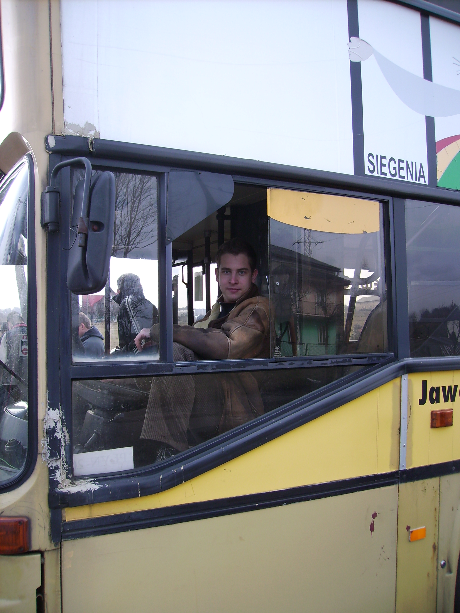
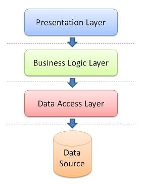
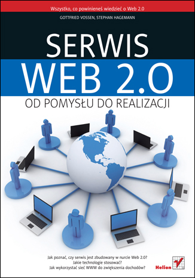
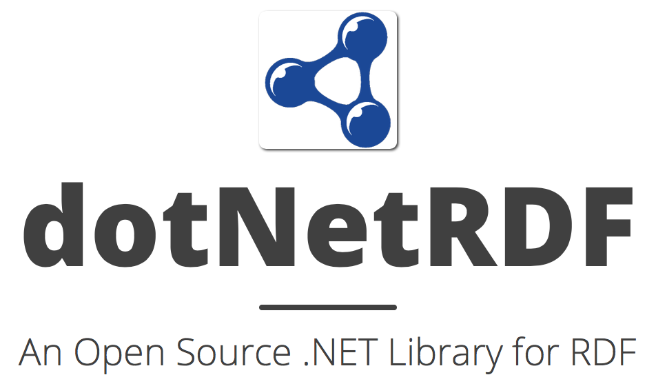
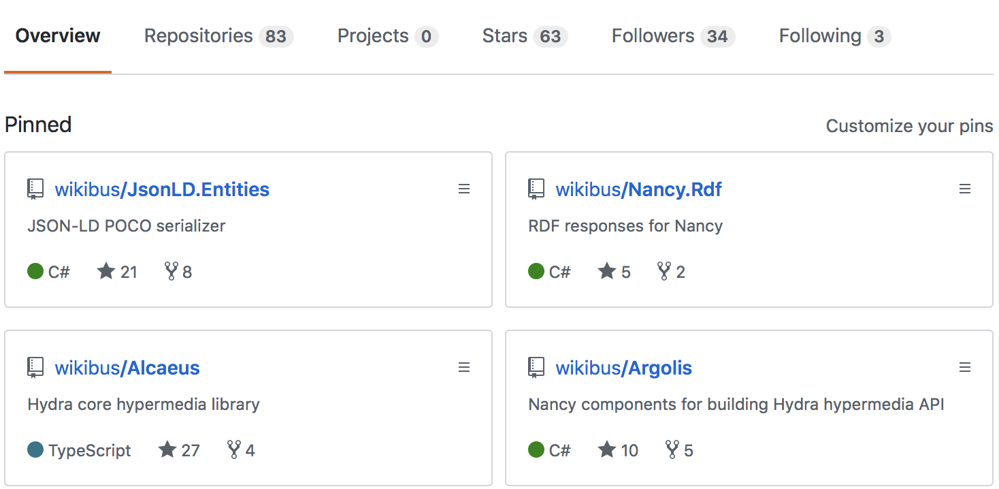
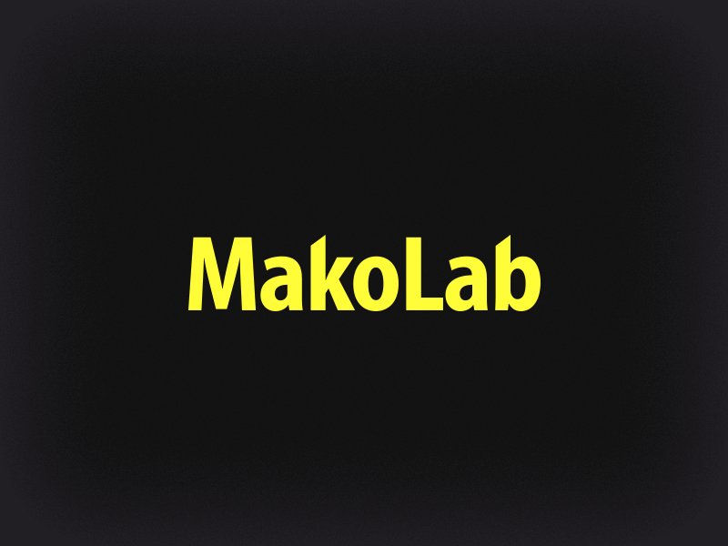
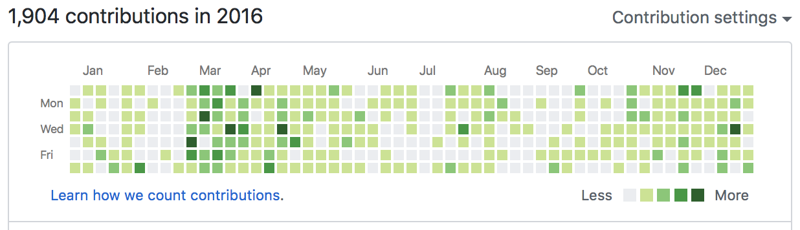

# GitHub jako ścieżka (do) kariery
## Tomasz Pluskiewicz

---

## Agenda

1. Trochę historii
1. GitHub, czyli dać się poznać :tm:
1. Niespodziewane efekty
1. Wyciągnięte nauki

---

## O mnie

* Mniej widoczny organizator Grupy WrocNet
* Nie programuję w .NET od 5 miesięcy
* Zainteresowania (kolejność przypadkowa)
  * REST API
  * Web Components
  * Semantic Web

[ /tpluscode](https://github.com/tpluscode)
[ /tpluscode](https://twitter.com/tpluscode)

---

## Jak to się zaczęło

^ 2000 prospektów, kilkadziesiąt książek

---

## Encyklopedia autobusowa
### wikibus.org

1. Pierwsze podejście - mediawiki 
  * PHP 🤮
  * szalenie ciężkie do rozszerzania
1. Drugie podejście
  * dedykowane rozwiązanie
  * database-first
1. Trzecie podejście 🤔
  * WIP

^ 
- dlaczego wikipedia się powiodła to ja nie wiem
- byłeś świeo po studiach
- postaci normalne OMG

---

## Serwis Web 2.0.
### Od pomysłu do realizacji

* Historia sieci WWW
* Technologie wykorzystywane w sieci WWW
* Wykorzystanie języka XML
* Zastosowania technologii AJAX
* Platformy przeznaczone do tworzenia rozwiązań zgodnych z Web 2.0
* Reklama w sieci
* Handel elektroniczny

^ trąci myszką?

---

## Punkt zwrotny
### Resource Description Framework

^ 
- trochę jak neo4j, lecz wszędzie URL
- jak NoSQL - elastyczny model
- porzuciłem wtedy model SQL, w którym prawie zamodelowałem RDF

---

^ 
- mniej natworzyłem kodu, więcej spraw organizacyjnych
- ciekawe gdzie pasowałbym do klasyfikacji Pawła Klimczyka

---

## Co dalej...

* REST APIs
* [Hydra Community Group](https://hydra-cg.com)
* Web Components

Obecnie posiadam >100 repozytoriów na GitHubie

^ 
- ktoś ostatnio powiedział, że 60 (?) to bardzo dużo
- wszędzie RDF
- Web Componenty dzięki Bradowi Jones'owi

---

## Gdzie ta encyklopedia?

---

^ 
- projekt autobusowy zaczynałem ze 3 razy
- biblioteki przepisywane kilka razy

---

---

## (Nie)spodziewane korzyści

^ Dwa razy dostałem pracę, dzięki publicznej aktywności

---

### Rok 2014

* firma z Łodzi

* dotNetRDF
* Projekt unijny
* praca na wpół zdalna (właściwie 75%)

^ 
- studia skończyłem w 2010
- prawie przeprowadziłem się do Łodzi lol

---

### Rok 2018

* ex-startup ze Szwajcarii

* Open Data
* Hydra
* Web Components
* praca zdalna 100%

^ 
- best job ever
- nie przeprowadzam się

---

## Wnioski

* zatrudnienie nigdy nie było celem jako takim
* nie trzeba skupiać się na jednym projekcie OSS
* zaangażowanie nie jest ciągle na 100%

^ 
- nie byłem najlepszym contributorem
- zainteresowanie inne niż projekty w firmie pozwala uniknąć wypalenia 

---

^ analogia szukania żyły złota

---

## Zakończenie

- nisza, a nie wszechstronność
- wytrwałość, lecz nie za wszelką cenę
- droga, a nie cel
- cel nie musi być technologiczny

^
- im nisza bardziej ezoteryczna tym łatwiej się przebić, czyli róbcie to co Was fascynuje

---

## Dziękuję