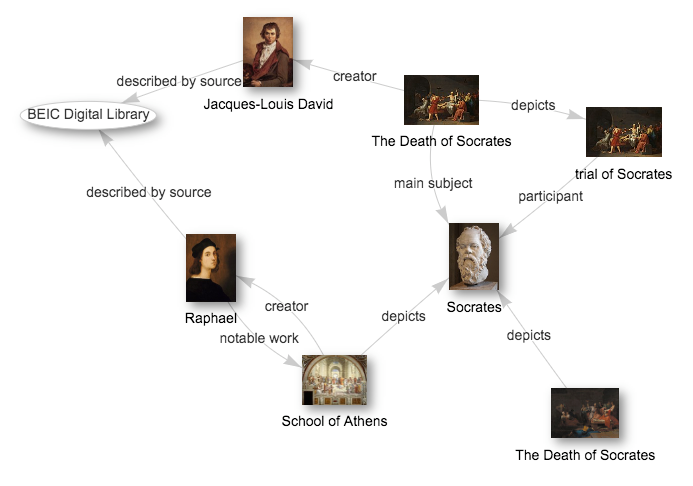
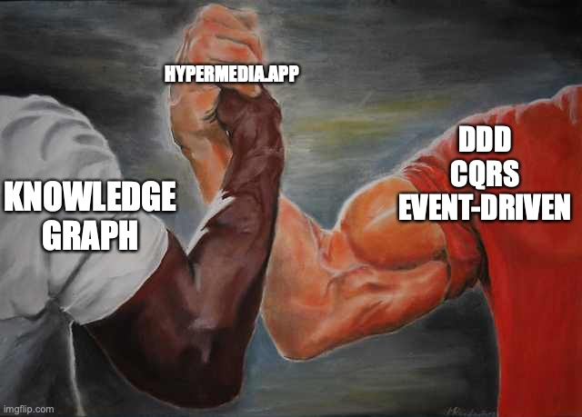
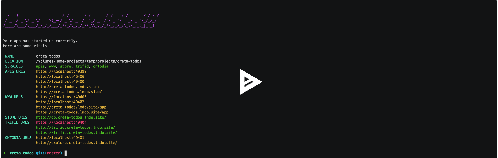

autoscale: true
Theme: Huerta, 2
slide-dividers: #
footer: Tomasz Pluskiewicz ::  tpluscode :: [Knowledge Graph Conference](https://www.knowledgegraph.tech) :: 2022

# Bridging the gap between business domains and Knowledge Graphs

# About the author

* Tomasz Pluskiewicz
* Zazuko GmbH
* Interests
    * Semantic Web
    * REST APIs
    * Hydra CG

 [ /tpluscode](https://github.com/tpluscode)
 [@tpluscode](https://twitter.com/tpluscode)
✍ [t-code.pl️](https://t-code.pl)


# Agenda

1. Intro (this)
2. Building an API backed by Knowledge Graph
   - Classic Example - Todo App
   - Step-by-step walkthrough
3. Showcase of basic UI (web app)
4. How to start from scratch
5. Closing remarks

# Knowledge Graphs
## What are they?

# What is a Knowledge Graph?

- [KG] represents a network of real-world entities—i.e. objects, events, situations, or concepts—and illustrates the relationship between them[^IBM1]
- A digital structure that represents knowledge as concepts and the relationships between them (facts)[^WIKI1]
- A knowledge model: a collection of interlinked descriptions of concepts, entities, relationships and events[^ONTOTEXT1]



[^IBM1]: [What is a knowledge graph?](https://www.ibm.com/cloud/learn/knowledge-graph)

[^WIKI1]: [Knowledge graph](https://en.wikipedia.org/wiki/Knowledge_graph)

[^ONTOTEXT1]: [What is a Knowledge Graph?](https://www.ontotext.com/knowledgehub/fundamentals/what-is-a-knowledge-graph/)

# Knowledge Graphs
## Where to they come from?

# Knowledge Graphs
## Where to they come from?

- [Knowledge Graph – A Powerful Data Science Technique to Mine Information from Text](https://www.analyticsvidhya.com/blog/2019/10/how-to-build-knowledge-graph-text-using-spacy/)

> "mine information from Wikipedia pages"

> "make this text data readable for machines"

# Knowledge Graphs
## Where to they come from?

- [Ontotext: How-to: Building Knowledge Graphs in 10 Steps](https://www.ontotext.com/knowledgehub/fundamentals/how-to-building-knowledge-graphs-in-10-steps/)

> "Apply ETL tools to convert your data to RDF"

# Knowledge Graphs
## Where to they come from?

- [How to Create a Knowledge Graph from Data?](https://web.stanford.edu/class/cs520/2020/notes/How_To_Create_A_Knowledge_Graph_From_Data.html)

> "Large organizations generate lot of internal data"

> "creating a knowledge graph by integrating the data available from structured sources"

# Knowledge Graphs
## Where to they come from?

- [neo4j Tutorial: Build a Knowledge Graph using NLP and Ontologies](https://neo4j.com/developer/graph-data-science/build-knowledge-graph-nlp-ontologies/)

> "entities extracted using APOC NLP procedures and Ontologies extracted using neosemantics"

---

> Data integration consumes
> 35%-65% of IT budget
-- Data-Centric Manifesto[^CENTRIC]

[^CENTRIC]: http://datacentricmanifesto.org/principles/

# Can we do different?
## (better?)

# Knowledge Graph
## Not as an afterthought

[.column]

**Turtles all the way down**

1. Almost everything is part of the knowledge graph
2. As little code as possible
3. Adopt standards

[.column]

**Team-friendly**

1. Adopt and learn from best industry practices
2. Publish data as APIs
3. Compelling, end-to-end toolset

^ portability
accessibility
security

^ best practices: modeling, implementation

# Project setup
## hypermedia.app

Tools for building hypermedia-driven application using open web standards

[.column]

- [/hypermedia-app](https://github.com/hypermedia-app)
   - [Creta](https://github.com/hypermedia-app/shaperone)
     Hydra APIs in node (express)
   - [Shaperone](https://github.com/hypermedia-app/shaperone)
     SHACL Form builder
   - [Roadshow](https://github.com/hypermedia-app/roadshow)
     SHACL UI builder
   - [Shell](https://github.com/hypermedia-app/hydrofoil-shell)
     Framework for a complete web app
- All Open Source

[.column]

- Based on standards
  - [SPARQL](http://www.w3.org/TR/sparql11-overview/)
  - RDFS/[SHACL](https://www.w3.org/TR/shacl/)
  - [Web Access Control](https://solid.github.io/web-access-control-spec/)
  - [Hydra](http://www.hydra-cg.com/spec/latest/core/)
  - [RFC 7807 - Problem Details for HTTP APIs](https://datatracker.ietf.org/doc/html/rfc7807)
  - [RFC 6570 - IRI Template](https://datatracker.ietf.org/doc/html/rfc6570)
  - [Web Components](https://developer.mozilla.org/en-US/docs/Web/Web_Components)

# Project setup
## Runtime setup

[https://a.maze.link/kgc-tutorial-start](https://a.maze.link/kgc-tutorial-start)

- Node monorepo (yarn)
- Local docker setup (via Lando)
- Including local graph database (AllegroGraph)
  - requirements are SPARQL & reasoning

^ Lando on WSL problematic

# Showtime


^ much to cover

---



# Recap

- Everything is a resource
- Graph Per Resource
- Explicit authorizations (API-only)
- Standards
- Inferencing
- Low-code but not no-code

---

# Bonus
## Starting from scratch is easy too!

[.column]

[/hypermedia-app/creta-template-app](https://github.com/hypermedia-app/creta-template-app)

[Install pipx](https://github.com/pypa/pipx#install-pipx) and then:

```shell
pipx install "copier==6.0.0b0"

copier -a .copier-creta.yaml \
  gh:hypermedia-app/creta-project-template.git \
  project-name
```

Update any time:

```shell
copier -a .copier-creta.yaml -s apps/api update
```

[.column]

<br>
<br>
<br>
<br>
<br>
<br>

[](https://asciinema.org/a/RCToq4LcB6YhmKTpS2ILddvsg)

---

# Roadmap

[.column]

Creta:

- Knossos: Performance optimizations
- Knossos: [SHACL AF 1.1](https://w3c.github.io/shacl/shacl-af/)
- Talos: watch mode
- Talos: migrations
- Talos: trig
- Talos: dynamic representations
- Talos: resource verification

[.column]

Shaperone:

- More live examples
- Design types (look & feel)
- Best practices

Roadshow:

- Stabilize
- Best practices
- Documentation ❗️

# Call to action


---


