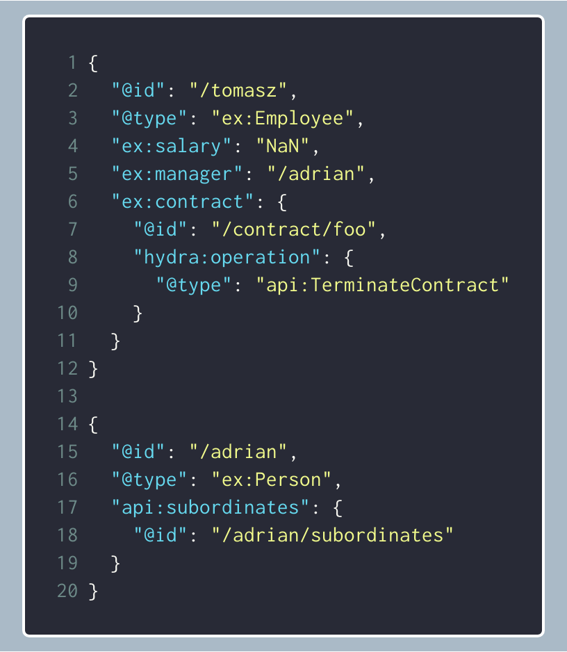

autoscale: true
theme: Letters from Sweden, 4
slide-dividers: #, ##
footer: Tomasz Pluskiewicz ::  tpluscode :: Nordic APIs Platform Summit :: 2019

# Bringing hypermedia to the masses

## About me

* Tomasz Pluskiewicz
* Zazuko GmbH
* Interests
  * Semantic Web
  * REST APIs
  * Hydra CG

 [/tpluscode](https://github.com/tpluscode)
 [@tpluscode](https://twitter.com/tpluscode)


## REST Fest 

* 9th year in Greenville, SC
* Second time in Europe
* [restfest.org](https://restfest.org) and  @restfest


## Agenda

- Quo vadis web development?
- Hypermedia-driven UI
- Demo
- Testing API
- Questions

## State of web development 
### AD 2016

[.hide-footer]
[.background-color: #FFFFFF]


## State of web development AD 2016

- Brittle APIs
  - No links
  - No runtime-discoverability

## State of web development AD 2016

- UI full of out-of-band knowledge
  - Routing in SPAs is the devil
  - Applications make presumptions about representations

## What are the effects?

- Code generation
- Hard coding interactions
- Relying on specific URL strucutres

## We can do better

[.hide-footer]
[.background-color: #FFFFFF]


---


---


---


---


---


## We can do better...
### ...with Hypermedia

[.hide-footer]
[.background-color: #FFFFFF]


## Hypermedia-driven web application

- Routing differently
- Rich media type
- Composing the visual elements

## "Routing"


- Direct relation between browser URL and resource identifier

## "Routing"


- Plain Old Single-Page Application

## "Routing"


| path | base API URL |
| --- | --- |
| `/library/` | `sources.wikibus.org/` |
| `/home/` | `bff.wikibus.org/` |
| `/vehicles/` | `vehicles.wikibus.org/` |

## "Routing"


```http
GET /brochure/1300 HTTP/1.1 
Host: sources.wikibus.org
```

## Runtime resource discovery
### Hydra

- Based on JSON-LD (RDF)
  - web-first design
- IMO the most complete[^1] hypermedia media type

[^1]: or at least most promising

## Hydra
### Resource representation

```json
{
  "@context": "https://wikibus.org/_context/book",
  "@id": "https://sources.wikibus.org/book/414",
  "@type": "Book",
  "schema:title": "Volvo 75 years 1972-2002",
  "schema:isbn": "3907153251",
  "hydra:operation": {
    "@type": "schema:UpdateAction",
    "hydra:method": "PUT",
    "hydra:expects": "Book"
  }
}
```

## Hydra
### API Documentation

```json
{
  "@type": "hydra:ApiDocumentation",
  "hydra:supportedClass": [{
    "@id": "Book",
    "hydra:supportedProperty": [{
      "rdf:property": { "@id": "schema:isbn" }
    }, {
      "hydra:property": {
        "@id": "author", "@type": "hydra:Link"
      }
    }]
  }]
}
```

## Hydra
### Collection

```json
{
  "@context": "https://wikibus.org/_context/book_collection",
  "@id": "https://sources.wikibus.org/books",
  "@type": "hydra:Collection",
  "hydra:manages": {
      "hydra:property": "rdf:type",
      "hydra:object": "Book"
  },
  "hydra:search": {
    "hydra:template": "/books{/page}{?title,author,language}"
  }
}
```

## Uniform interface constraint

> REST's uniform interface constraints is not only about the protocol (HTTP).
> One must also consider the media type and possibly app-specific semantics.
-- Tomasz Pluskiewicz

---

[.hide-footer]


---

[.hide-footer]


---

[.hide-footer]


---

[.hide-footer]


---

[.hide-footer]


---

[.hide-footer]


---

[.hide-footer]


## Uniform interface

[.hide-footer]
[.background-color: #FFFFFF]


- Vocabulary reuse
- Representation patterns
- Matryoshka UI

^ The application is a specialised API browser

## Matryoshka UI
### `@lit-any/views`

```js
import { html } from 'lit-html'

export default {
  template: (state, next) => html`
      ${next(state.core.resource, 'page-title')}
      <section id="content">
        <div class="content-wrap">
          ${next(state.core.resource, 'main-content')}
        </div>
      </section>`
}
```

## Matryoshka UI

```js
import { html } from 'lit-html'
import resourceIs from './matchers.js'

export default {
  scope: 'page-title',
  valueMatcher: resourceIs('api:Entrypoint')),
  template: (state, next) => html`
    <canvas-emphasis-title
      ?hidden="${state.pageTitle.hidden}"
       background-image="${state.pageTitle.background}"
      .heading="${state.core.resource.title}"
      .lead="${state.core.resource.description}"
    ></canvas-emphasis-title>`
}
```

## Generated forms
### `@lit-any/forms`

- Generates HTML forms from an abstract description of fields
  - agnostic of media-type
  - integration with Hydra as an extension
- Look & feel customizable through component sets

^ no code because it's not revolutionary and does not nicely fit a single slide

## Demo
### Coding time

[.hide-footer]


## Hypermedia-driven testing

```yaml
With Class ex:Employee {
    Expect Property ex:salary
    Expect Link ex:manager

    Expect Property ex:contract {
        Expect Operation api:TerminateContract {
            Invoke {
                Expect Status 204
            }
        }
    }
}

With Link ex:manager {
    Expect Link api:subordinates 
}
```

[testing.hypermedia.app](https://testing.hypermedia.app)



## Hydra static analysis

Checks contents of API's `hydra:ApiDocumentation` for potential mistakes

- online on [analyse.hypermedia.app](https://analyse.hypermedia.app)
- also a [CLI tool](https://www.npmjs.com/package/hydra-validator-analyse)


## Summary
### What works and what doesn't?

- Routing
  - What about non-resource views?
- State is more than just representations

## Future work

- (UI) Code on demand
- Identifying and documenting functional and non-functional patterns
   - [building.hypermedia.app](https://building.hypermedia.app)
   - [generic.hypermedia.app](https://generic.hypermedia.app)

^ would code in demand be app-specific only?

## Links

- `ld-navigation` (routing)
  - [github.com/tpluscode/ld-navigation](https://github.com/tpluscode/ld-navigation)
- `@lit-any`
  - [github.com/hypermedia.app/lit-any-views](https://github.com/hypermedia.app/lit-any-views)
  - [github.com/hypermedia.app/lit-any-forms](https://github.com/hypermedia.app/lit-any-forms)
  - [lit-any.hypermedia.app](https://lit-any.hypermedia.app)
- Alcaeus (Hydra client)
  - [alcaeus.hydra.how](https://alcaeus.hydra.how)

## Links

- [building.hypermedia.app](https://building.hypermedia.app)
- [testing.hypermedia.app](https://testing.hypermedia.app)

- Generic Hydra browser
  - [generic.hypermedia.app](https://generic.hypermedia.app)

---

[.hide-footer]
