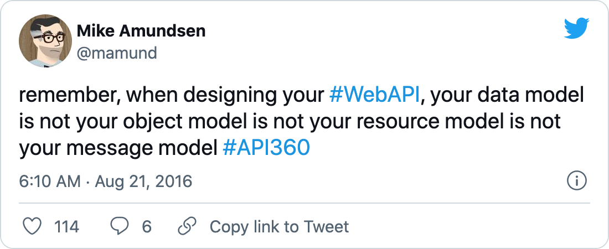

autoscale: true
Theme: Plain Jane, 7
slide-dividers: #
slidenumbers: true
slidecount: true
footer: Tomasz Pluskiewicz ::  tpluscode :: [Nordic APIs LiveCast - Evolving Hypermedia](https://nordicapis.com/events/evolving-hypermedia/) :: 2021

## Your API is Your API is Your API

---

### Or is it? [^Amundsen]

[^Amundsen]: [https://twitter.com/mamund/status/767212233759657984](https://twitter.com/mamund/status/767212233759657984)

^This still works on ISO/OSI level of HTTP, TCP, IP

---

## First, history

#### Where APIs come from?

---

### Paul Baran's Networks [^Barabasi]

[^Barabasi]: [Linked: How Everything Is Connected to Everything Else and What It Means for Business, Science, and Everyday Life](https://www.amazon.com/Linked-Everything-Connected-Business-Everyday/dp/0452284392)

---

### Fieding's Disseratation [^Fielding]

> Fielding’s dissertation is not about how to build APIs on top of HTTP but rather about HTTP itself.
-- Sinclair Target [^Target]

[^Target]: [Roy Fielding's Misappropriated REST Dissertation](https://twobithistory.org/2020/06/28/rest.html)

[^Fielding]: [Architectural Styles and the Design of Network-based Software Architectures](https://www.ics.uci.edu/~fielding/pubs/dissertation/fielding_dissertation_2up.pdf)

^The name “Representational State Transfer” is intended to evoke an image of how a well-designed Web application behaves: a network of web pages (a virtual state-machine), where the user progresses through the application by selecting links (state transitions), resulting in the next page (representing the next state of the application) being transferred to the user and rendered for their use.

---
[.background-color: #000000]
[.hide-footer]

### Information Management: A Proposal [^TimBL]

[^TimBL]: [https://www.w3.org/History/1989/proposal.html](https://www.w3.org/History/1989/proposal.html)

^Those are real thing, linked together

---

## Everything is a resource
### if you're brave enough

---

### Linked Data

[Linked Open Data Cloud (lod-cloud.net)](https://lod-cloud.net)

As of May 2020 the dataset contained **1301** datasets with **16283** links.

Grouped in **9** categories.

---

### 5-star Linked Data [^TimBL-LD]

[^TimBL-LD]: https://www.w3.org/DesignIssues/LinkedData.html

---

### So what are APIs?

^graphs of web resources connected with unambiguous links!

---

## Examples

---

[.build-lists: true]

### Data as a resource

A bus registration [^reg]

- identified by an URI (**`@id`**)
- links to its type
(**`api/Registration`**)
- links to other resources
(**`company/mza-warszawa`**)
- uses unambiguous property names
(**`https://bus.name/vocab#vehicle`**)
- uses shared vocabulary terms
(**`prefLabel`, `numberOfAxles`**)

[^reg]: [https://tinyurl.com/ahc9b2c](https://tinyurl.com/ahc9b2c)

^mention it is JSON-LD

---

[.build-lists: true]

### Class as a resource

`Owner` class [^class]

- identified by URI
- uses shared vocabulary terms
(**`rdfs:class`, `schema:Organization`**)
- class hierarchy expressed as links
(**`rdfs:subClassOf`**)

[^class]: [https://tinyurl.com/3zrcv2sr](https://tinyurl.com/3zrcv2sr)

^those are two separate resources

---

[.build-lists: true]

### Data model as a resource

Shape of `Registration` resources [^shacl]

- SHACL Shapes Constraint Language
  - W3C Vocabulary
  - [https://w3.org/tr/shacl](https://w3.org/tr/shacl)
  - Described graph data structures
  - Validation rules
  - Many other use cases
  - Easily extensible

[^shacl]: [https://tinyurl.com/v7vkeuj8](https://tinyurl.com/v7vkeuj8)

^ SHApes Constraint Language

---

[.build-lists: true]

### Hypermedia as a resource

[Hydra W3C Community Group](https://hydra-cg.com/) [^hydra]

- describes APIs with RDF
  - like OpenAPI but discovered at runtime
  (**HTTP `Link` header**)
- provides possible state transitions (among other things)

[^hydra]: [https://tinyurl.com/24tku578](https://tinyurl.com/24tku578)

---

[.build-lists: true]

### Access Control as a resources

[Basic Access Control ontology](https://solid.github.io/web-access-control-spec/) [^acl]

- Another shared vocabulary
- Started by Tim Berners-Lee
- Now part of [SOLID Project](https://solidproject.org)

[^acl]: [https://tinyurl.com/2ekfmhrb](https://tinyurl.com/2ekfmhrb)

^group is also a resource, and users are resources...

---

[.build-lists: true]

#### SaaS is dead. Long live...

### Software as a Resource?
### Resource as a Service?

---

---

---

---

## Why?

[.quote: Avenir Next Italic]

[.column]

- Discoverability
- Evolvability
- Longevity

[.column]

> Data is self-describing and does not rely on an application for interpretation and meaning.
-- Data-Centric Manifesto[^manifesto]

[^manifesto]: [http://www.datacentricmanifesto.org](http://www.datacentricmanifesto.org)

---

## Resources (no pun intended)

This presentation: [tpluscode@github/presentations/nordic-apis-live-hypermedia](https://github.com/tpluscode/presentations/tree/master/nordic-apis-live-hypermedia)

[.column]

- [Linked: How Everything Is Connected to Everything Else and What It Means for Business, Science, and Everyday Life](https://www.amazon.com/Linked-Everything-Connected-Business-Everyday/dp/0452284392)
- [What does the history of the web tell us about its future?](https://derivadow.com/2009/03/26/what-does-the-history-of-the-web-tell-us-about-its-future/)
- [Roy Fielding's Misappropriated REST Dissertation](https://twobithistory.org/2020/06/28/rest.html)
- [Architectural Styles and the Design of Network-based Software Architectures](https://www.ics.uci.edu/~fielding/pubs/dissertation/fielding_dissertation_2up.pdf)
- [Information Management: A proposal](https://www.w3.org/History/1989/proposal.html)
- [Linked Open Data Cloud](https://lod-cloud.net)
- [Linked Data Stars](https://www.w3.org/DesignIssues/LinkedData.html)
- [Data-Centric Manifesto](http://www.datacentricmanifesto.org)

[.column]

- [Resource Description Framework](https://www.w3.org/TR/rdf11-primer/)
- [SKOS Simple Knowledge Organization System](https://www.w3.org/TR/skos-primer/)
- [schema.org](https://schema.org)
- [SHACL Shapes Constraint Language](https://w3.org/tr/shacl)
- [Wikidata](https://www.wikidata.org/)
- [Hydra W3C Community Group](https://hydra-cg.com/)
- [Basic Access Control ontology](https://solid.github.io/web-access-control-spec/)
- [SOLID Project](https://solidproject.org)
