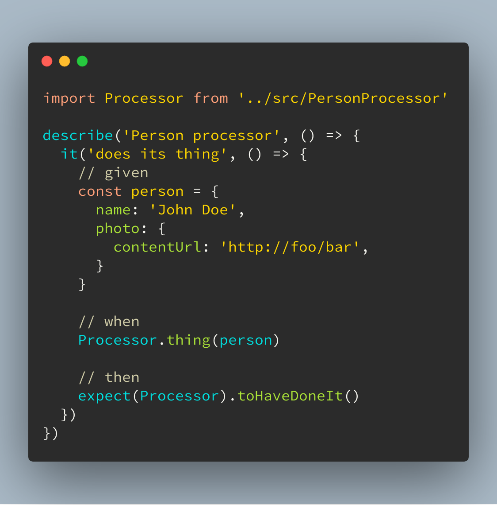

autoscale: true
theme: Huerta, 2
slide-dividers: #
footer: Tomasz Pluskiewicz ::  tpluscode :: us2ts :: 2020

# Redefining
## Accessing graphs

# About me

* Tomasz Pluskiewicz
* Zazuko GmbH
* Interests
  * Semantic Web
  * REST APIs
  * Hydra CG

 [/tpluscode](https://github.com/tpluscode)
 [@tpluscode](https://twitter.com/tpluscode)

# The challenge

RDF is hard
RDF/JS is also hard
   * or at least verbose
   * contrary to what some will tell you[^1]
   * especially for novices

How do we get new devs into the RDF(/JS) space?

[^1]: https://www.rubensworks.net/blog/2019/10/06/using-rdf-in-javascript/

# Prior work

1. [Romantic Web](https://romanticweb.net)
1. [JsonLD.Entities](https://github.com/wikibus/JsonLD.Entities)

* Rigid structures
* Destructive conversion
* Impendace mismatch

# @tpluscode/rdfine[^2]

* Familiar JS objects
* Not detached from underlying RDF/JS model
   * A `DatasetCore` behind the scenes
* Uses clownface[^3] by Thomas Bergwinkl
* TypeScript w/decorators
   * but usable with Babel

   
[^2]: https://npm.im/@tpluscode/rdfine

[^3]: https://npm.im/clownface

---

---

---
[.hide-footer]

---
[.hide-footer]

---
[.hide-footer]

# Unit test friendly

* Unit tests without RDF dependency
  * Easier to understand
  * Easier to set up
  * Easier to manage
  * Self-contained

# Next up
#### Reusable packages with pre-built classes

# More tools

* Used by @tpluscode/rdfine
   * [clownface](https://npm.im/clownface) by Thomas Bergwinkl

* Some more helpful libraries I build
  * [@tpluscode/rdf-ns-builders](https://npm.im/@tpluscode/rdf-ns-builders)
  * [@tpluscode/rdf-string](https://t-code.pl/rdf-string)
  * [@tpluscode/sparql-builder](https://t-code.pl/sparql-builder)

# Thank you